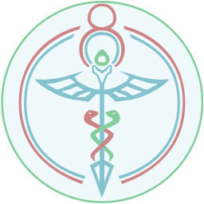
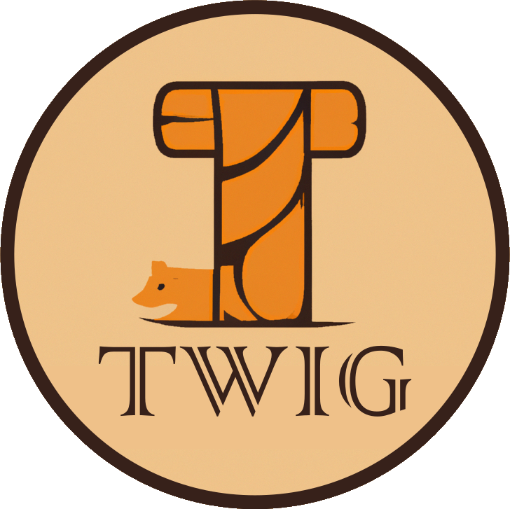

    <h2>Hey There Traveler</h2>

I'm Ben, your typical mad computer scientist. Graduate of North Carolina State
University (2022). I'm an avid learner and DIY practioner. My projects are almost
always the product of one of two things:
1) The challenge and learning experience
2) Spite

 

 

<h2>My Projects</h2>

<table style="width:100%;">

<tr>
<td>
    
### [Sigil](https://github.com/alagyn/Sigil)

A strongly-typed, object oriented, high-level language.  
Everything you love about C++ and Python combined into a single package.

</td>
<td>    
</td>
</tr>
<tr>
<td>
    
### [Hermes](https://github.com/alagyn/Hermes)

A Context-Free-Grammar parser generator for C++.  
It's like Flex+Bison but probably worse.
</td>
<td>
    
    </td>
</tr>

<tr>
<td>
    
### [YikeBot](https://github.com/alagyn/CafeYike)

YikeBot is my personal Discord Chatbot with a severe case of scope creep.  
Originally written in Python, now converted to Java.

</td>
<td>

</td>
</tr>

<tr>
<td>

### [Twig](https://github.com/alagyn/Twig)

Twig is a simple SLF4J backend that dosn't require a PHD to set up.  
</td>
<td></td>
</tr>

<tr>
<td>

### [py-imgui-redux](https://github.com/alagyn/PyImGui-Redux)

Python bindings for the wonderful [Dear ImGui](https://github.com/ocornut/imgui) made with PyBind11
</td>
<td></td>
</tr>

<tr>
<td>

### [NodePasta](https://github.com/alagyn/NodePasta)

A freeform, node based visual scripting framework
</td>
<td></td>
</tr>
<tr>
<td>
    
### [Controlduino](https://github.com/alagyn/Controlduino)

An XBox controller emulator for use with non-native-USB Arduinos
</td>
<td></td>
</tr>
</table>
 

---

    <h3>
    Intelligence is not something we are born with, but a decision we make every day
    </h3>

